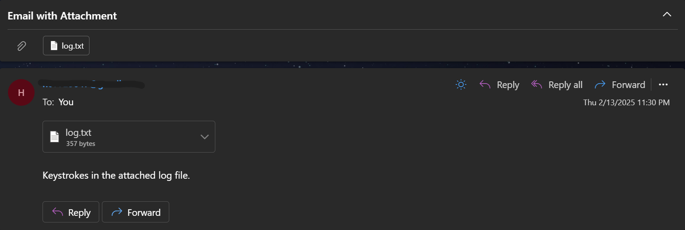

# Keylogger

This README provides instructions on how to run the Keylogger.

## Table of Contents

 [Keylogger](#keylogger)
  - [Table of Contents](#table-of-contents)
  - [Installation](#installation)
    - [Prerequisites](#prerequisites)
    - [Installation Steps](#installation-steps)
  - [Running the Codes](#running-the-codes)
  - [Description](#Description)
  - [Sample Output](#Sample-Output)

## Installation

### Prerequisites

Before installing pynput, make sure you have the following prerequisites:

1. **Python**: pynput requires Python 3.x. Make sure you have Python installed on your system. You can download Python from the official website: [Python Downloads](https://www.python.org/downloads/).

2.   **Pip**: Pip is the package manager for Python. It's usually included with Python, so you should have it available. You can check if Pip is installed by running `pip --version` in your terminal/command prompt.

### Installation Steps

1. Through your terminal or command prompt, install pynput using pip by running the following command:
```
pip install pynput
```
This will download and install pynput and its dependencies.

2. You can clone the code, once the installation is complete, using the command:
```
git clone https://github.com/HadiElNawfal/Keylogger
```

## Running the Codes

Before running the code, access to at least one gmail account is required:

You obtain the App Password by visiting `https://myaccount.google.com/` and signing in with the same gmail account. In the search bar, write `"App Passwords"`, enter your password again, and obtain the 16 letter password with 3 spaces in between. *keep the spaces when entering the password*.

Run the keylogger by typing `python Keylogger-to-Gmail.py` in a command prompt in the file's directory with the -s, -r, and -p arguments: sender email, receiver email, and a password.

* Enter in sender email the Gmail you used to obtain the App Password.
* Enter in receiver email the Gmail you desire to receive the logs on (it can be the same as the sender email).
* Enter the App Password.

## Description
* The keylogger creates a log.txt file in its directory when run.
* It stores all keystrokes in the log file except alt, ctrl, backspace, etc. This is to avoid cluttering the log.txt file up.
* Every 2 minutes, an email with log.txt attachment is sent to the email you specified in the code earlier.

## Sample Output
```
\
  _  __          _                                    _               _____                 _ _ 
 | |/ /         | |                                  | |             / ____|               (_) |
 | ' / ___ _   _| | ___   __ _  __ _  ___ _ __ ______| |_ ___ ______| |  __ _ __ ___   __ _ _| |
 |  < / _ \ | | | |/ _ \ / _` |/ _` |/ _ \ '__|______| __/ _ \______| | |_ | '_ ` _ \ / _` | | |
 | . \  __/ |_| | | (_) | (_| | (_| |  __/ |         | || (_) |     | |__| | | | | | | (_| | | |
 |_|\_\___|\__, |_|\___/ \__, |\__, |\___|_|          \__\___/       \_____|_| |_| |_|\__,_|_|_|
            __/ |         __/ | __/ |
           |___/         |___/ |___/


            by Hadi El Nawfal
Email with attachment sent successfully
```



